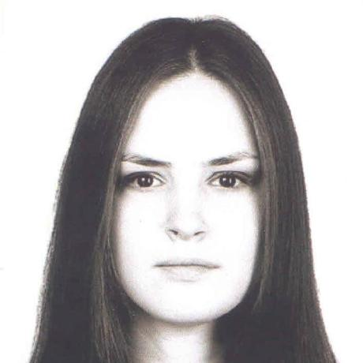

---
## Front matter
lang: ru-RU
title: Презентация к лабораторной работе 1
subtitle: Установка и конфигурация операционной системы на виртуальную машину
author:
  Аристова А.О.
institute:
  - Российский университет дружбы народов, Москва, Россия
date: 09 сентября 2024

## i18n babel
babel-lang: russian
babel-otherlangs: english

## Formatting pdf
toc: false
toc-title: Содержание
slide_level: 2
aspectratio: 169
section-titles: true
theme: metropolis
header-includes:
 - \metroset{progressbar=frametitle,sectionpage=progressbar,numbering=fraction}
 - '\makeatletter'
 - '\beamer@ignorenonframefalse'
 - '\makeatother'
---

## Докладчик

:::::::::::::: {.columns align=center}
::: {.column width="70%"}

  * Аристова Арина Олеговна
  * студентка группы НФбд-01-21
  * Российский университет дружбы народов
  * [1032216433@rudn.ru](mailto:1032216433@rudn.ru)
  * <https://github.com/aoaristova>

:::
::: {.column width="30%"}

:::
::::::::::::::

## Цель работы

Приобретение практических навыков
установки операционной системы на виртуальную машину, настройки минимально необходимых для дальнейшей работы сервисов.

## Задание

Установить на виртуальную машину операционную систему Linux Rocky, произвести ее минимальную настройку. 

# Выполнение лабораторной работы

## Создание виртуальной машины

Создаю новую виртуальную машину, задаю ей имя и тип операционной системы — Linux, RedHat:

{#fig:001 width=70%}

## Создание виртуальной машины

Настраиваю размер основной памяти виртуальной машины — 2048 МБ:

{#fig:002 width=70%}

## Создание виртуальной машины

Задаю размер виртуального жесткого диска: пока 20 ГБ, в случае необходимости увеличим.

{#fig:003 width=70%}

## Создание виртуальной машины

А затем мы можем посмотреть всю общую информацию о произведенных настройках:

{#fig:004 width=70%}

## Создание виртуальной машины

Далее подключаю образ операционной системы, который я заранее скачала с официального сайта Linux Rocky:

{#fig:005 width=35%}

## Настройка виртуальной машины

Запускаю виртуальную машину и выполняю необходимые настройки. Выбираю язык: English.

{#fig:006 width=60%}

## Настройка виртуальной машины

Затем я проверяю дату и часовой пояс, настраиваю раскладку клавиатуры, далее в разделе выбора 
программ указываю в качестве базового окружения **Server with GUI**, а в качестве дополнения — 
**Development Tools**.

{#fig:007 width=60%}

## Настройка виртуальной машины

Отключаю KDUMP:

{#fig:008 width=70%}

## Настройка виртуальной машины

Место установки ОС оставляю без изменения. Включаю сетевое соединение и в качестве имени узла указываю
aoaristova.localdomain.

{#fig:009 width=35%}

## Настройка виртуальной машины

Задаю пароль root:

{#fig:010 width=70%}

## Настройка виртуальной машины

Создаю пользователя:

{#fig:011 width=65%}

## Настройка виртуальной машины

И запускаю установку: 

{#fig:012 width=50%}

В VirtualBox оптический диск отключился автоматически.

## Домашнее задание 

Чтобы проанализировать последовательность загрузки системы, выполняю команду $dmesg$, также это можно сделать с помощью $dmesg | less$

{#fig:013 width=40%}

## Домашнее задание 

Затем я использую поиск для этого вывода: $dmesg | grep -i "то, что ищем"$:

{#fig:014 width=50%}

## Домашнее задание 

Получаю информацию о:

1. Версии ядра Linux (Linux version).

{#fig:015 width=70%}

## Домашнее задание 

2. Частоте процессора (Detected Mhz processor).

{#fig:016 width=70%}

## Домашнее задание 

3. Модели процессора (CPU0).

{#fig:017 width=70%}

## Домашнее задание 

4. Объеме доступной оперативной памяти (Memory available).

{#fig:018 width=70%}

## Домашнее задание 

5. Типе обнаруженного гипервизора (Hypervisor detected).

{#fig:019 width=70%}

## Домашнее задание 

6. Типе файловой системы корневого раздела

{#fig:020 width=50%}

## Домашнее задание 

7. Последовательность монтирования файловых систем.

{#fig:021 width=70%}

## Выводы
По результатам работы мною были закреплены практические навыки установки операционной системы на 
виртуальную машину, настройки минимально необходимых для дальнейшей работы сервисов, а также в рамках 
выполнения домашнего задания вспомнила и закрепила на практике использование команды dmesg.

