---
## Front matter
title: "Отчёт по лабораторной работе 1"
subtitle: "Установка и конфигурация операционной системы на виртуальную машину"
author: "Аристова Арина Олеговна"

## Generic otions
lang: ru-RU
toc-title: "Содержание"

## Bibliography
bibliography: bib/cite.bib
csl: pandoc/csl/gost-r-7-0-5-2008-numeric.csl

## Pdf output format
toc: true # Table of contents
toc-depth: 2
lof: true # List of figures
lot: true # List of tables
fontsize: 12pt
linestretch: 1.5
papersize: a4
documentclass: scrreprt
## I18n polyglossia
polyglossia-lang:
  name: russian
  options:
	- spelling=modern
	- babelshorthands=true
polyglossia-otherlangs:
  name: english
## I18n babel
babel-lang: russian
babel-otherlangs: english
## Fonts
mainfont: PT Serif
romanfont: PT Serif
sansfont: PT Sans
monofont: PT Mono
mainfontoptions: Ligatures=TeX
romanfontoptions: Ligatures=TeX
sansfontoptions: Ligatures=TeX,Scale=MatchLowercase
monofontoptions: Scale=MatchLowercase,Scale=0.9
## Biblatex
biblatex: true
biblio-style: "gost-numeric"
biblatexoptions:
  - parentracker=true
  - backend=biber
  - hyperref=auto
  - language=auto
  - autolang=other*
  - citestyle=gost-numeric
## Pandoc-crossref LaTeX customization
figureTitle: "Рис."
tableTitle: "Таблица"
listingTitle: "Листинг"
lofTitle: "Список иллюстраций"
lotTitle: "Список таблиц"
lolTitle: "Листинги"
## Misc options
indent: true
header-includes:
  - \usepackage{indentfirst}
  - \usepackage{float} # keep figures where there are in the text
  - \floatplacement{figure}{H} # keep figures where there are in the text
---

# Цель работы

Приобретение практических навыков
установки операционной системы на виртуальную машину, настройки минимально необходимых для дальнейшей работы сервисов.

# Задание

Установить на виртуальную машину операционную систему Linux Rocky, произвести ее минимальную настройку. 

# Выполнение лабораторной работы

## Создание виртуальной машины

Создаю новую виртуальную машину, задаю ей имя и тип операционной системы — Linux, RedHat:

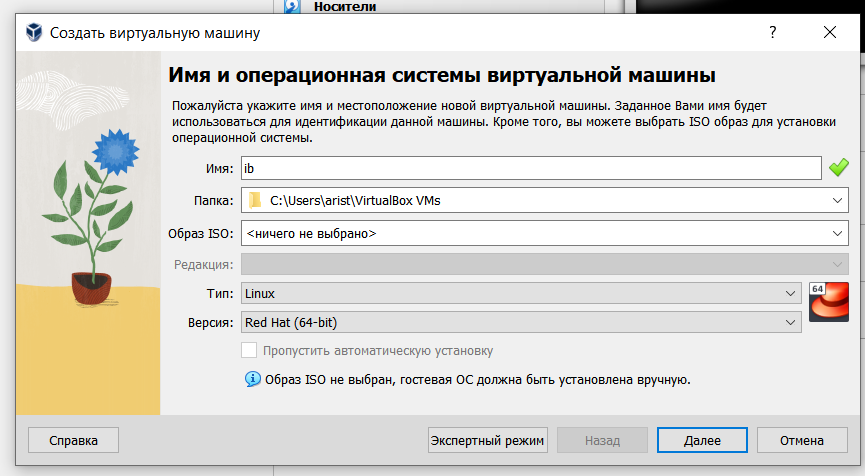{#fig:001 width=90%}

Настраиваю размер основной памяти виртуальной машины — 2048 МБ:

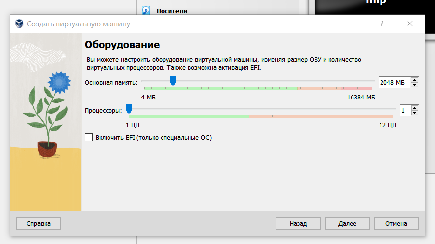{#fig:002 width=90%}

Задаю размер виртуального жесткого диска: пока 20 ГБ, в случае необходимости увеличим.

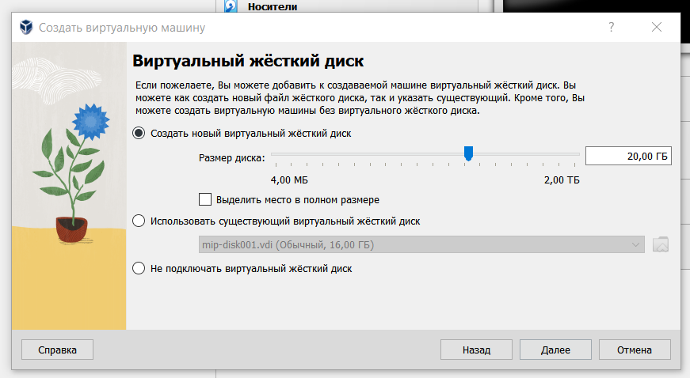{#fig:003 width=90%}

А затем мы можем посмотреть всю общую информацию о произведенных настройках:

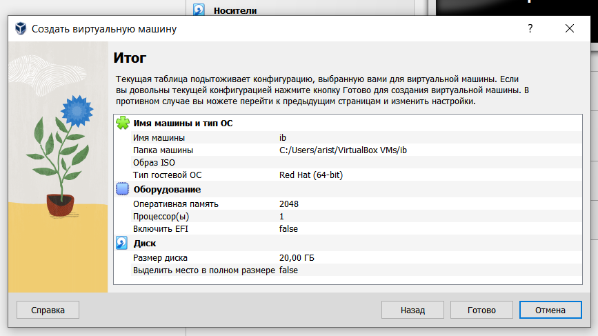{#fig:004 width=90%}

Далее подключаю образ операционной системы, который я заранее скачала с официального сайта Linux Rocky:

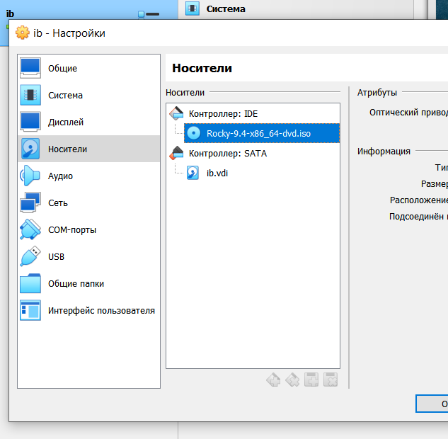{#fig:005 width=90%}

## Настройка виртуальной машины

Запускаю виртуальную машину и выполняю необходимые настройки. Выбираю язык: English.

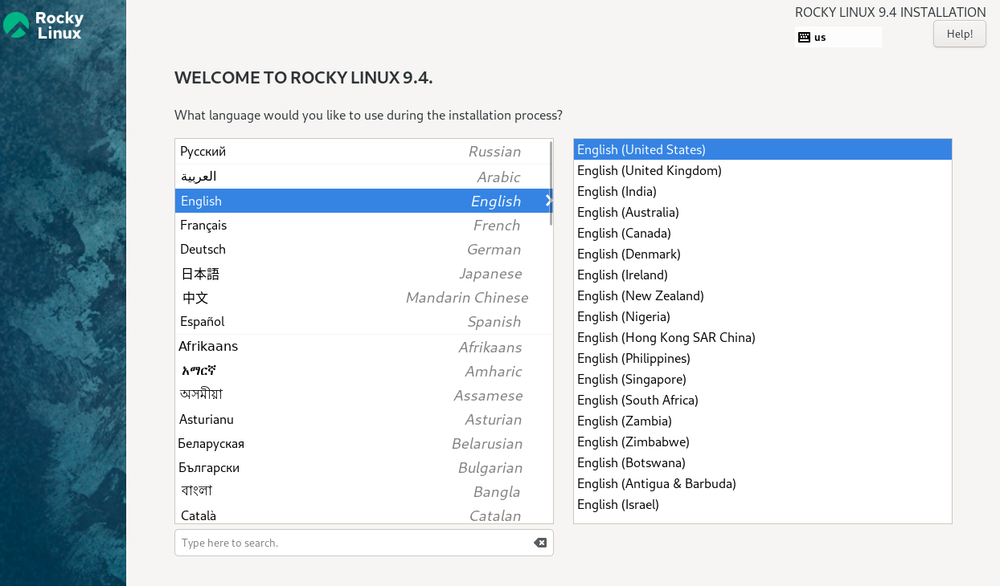{#fig:006 width=90%}

Затем я проверяю дату и часовой пояс, настраиваю раскладку клавиатуры, далее в разделе выбора 
программ указываю в качестве базового окружения **Server with GUI**, а в качестве дополнения — 
**Development Tools**.

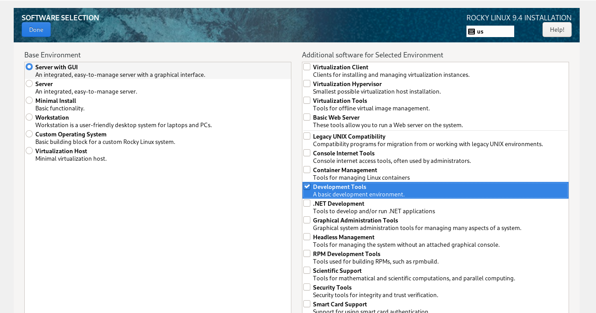{#fig:007 width=90%}

Отключаю KDUMP:

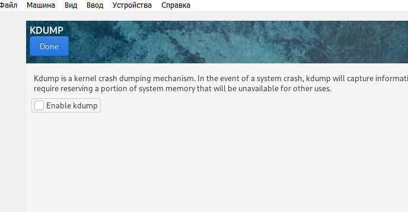{#fig:008 width=90%}

Место установки ОС оставляю без изменения. Включаю сетевое соединение и в качестве имени узла указываю
aoaristova.localdomain.

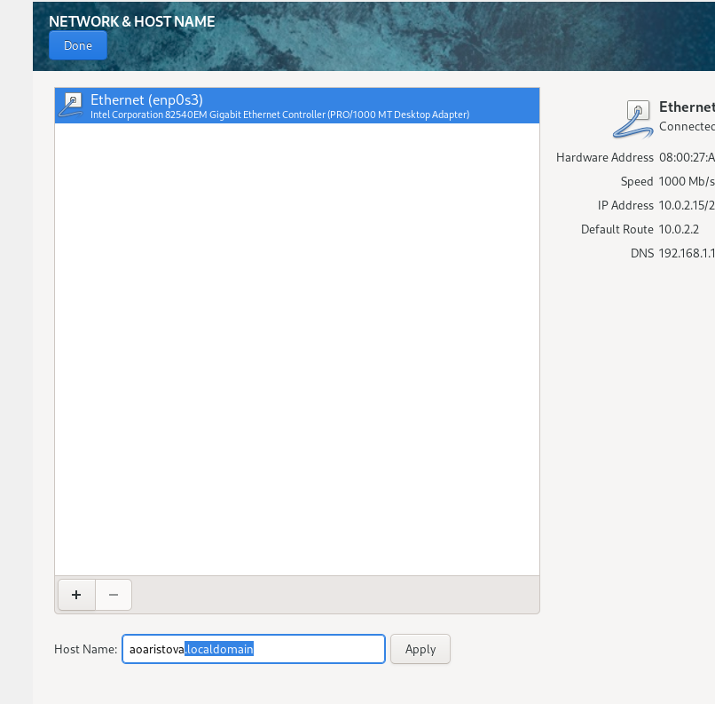{#fig:009 width=90%}

Задаю пароль root:

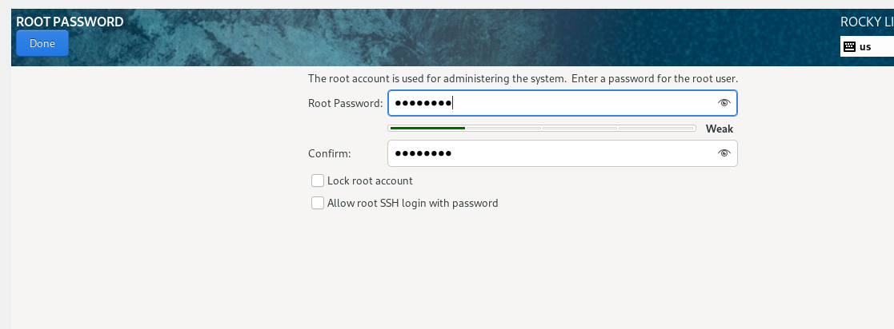{#fig:010 width=90%}

Создаю пользователя:

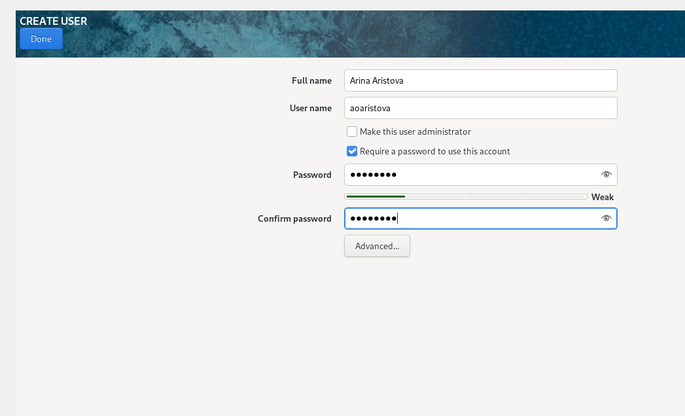{#fig:011 width=90%}

И запускаю установку: 

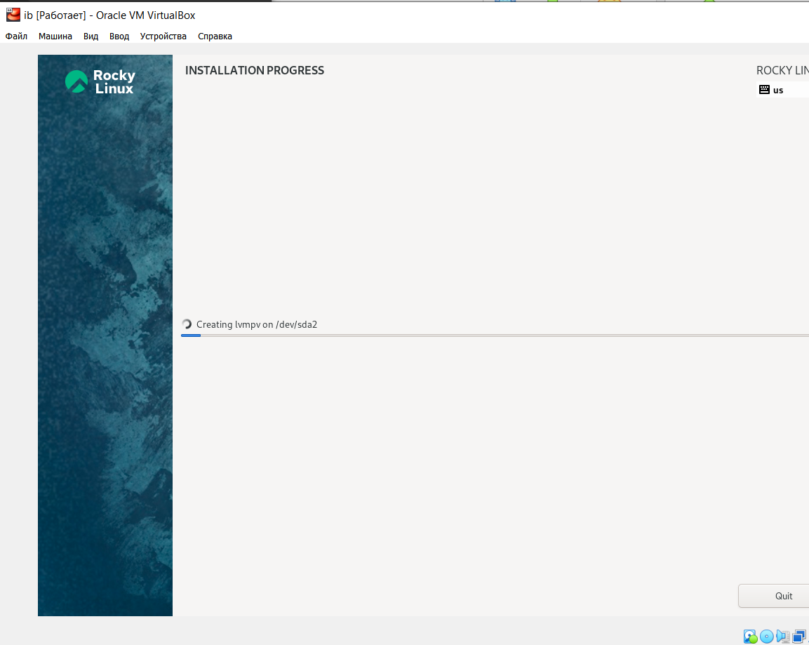{#fig:012 width=90%}

В VirtualBox оптический диск отключился автоматическ.

## Домашнее задание 

Чтобы проанализировать последовательность загрузки системы, выполняю команду $dmesg$, также это можно сделать с помощью $dmesg less$

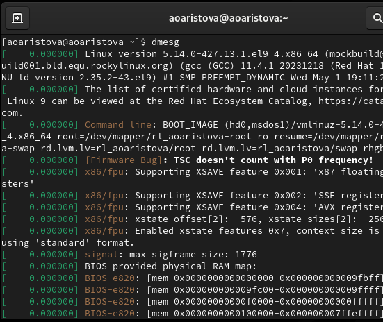{#fig:013 width=90%}

Затем я использую поиск для этого вывода: $dmesg | grep -i "то, что ищем"$:

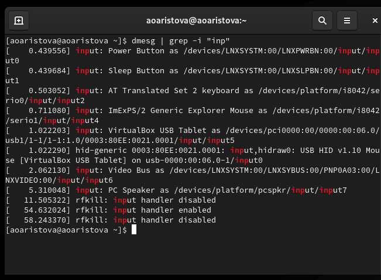{#fig:014 width=90%}

Получаю информацию о:

1. Версии ядра Linux (Linux version).

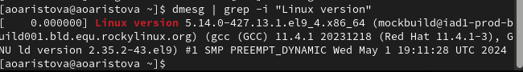{#fig:015 width=90%}

2. Частоте процессора (Detected Mhz processor).

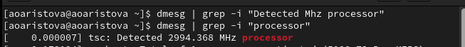{#fig:016 width=90%}

3. Модели процессора (CPU0).

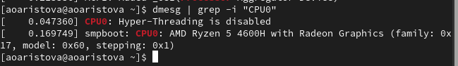{#fig:017 width=90%}

4. Объеме доступной оперативной памяти (Memory available).

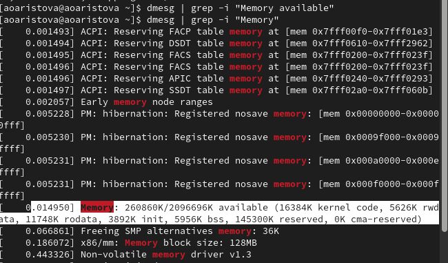{#fig:018 width=90%}

5. Типе обнаруженного гипервизора (Hypervisor detected).

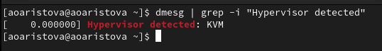{#fig:019 width=90%}

6. Типе файловой системы корневого раздела

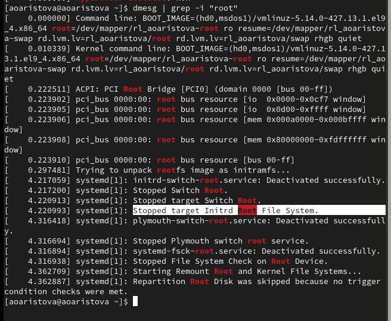{#fig:020 width=90%}

7. Последовательность монтирования файловых систем.

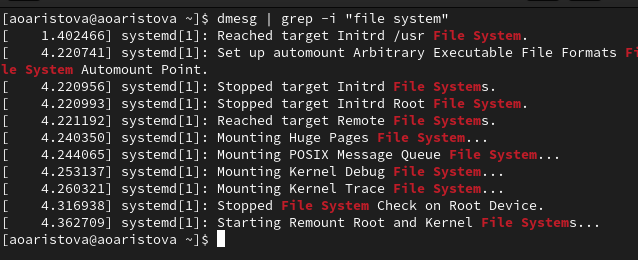{#fig:021 width=90%}

# Выводы
По результатам работы мною были закреплены практические навыки установки операционной системы на 
виртуальную машину, настройки минимально необходимых для дальнейшей работы сервисов, а также в рамках 
выполнения домашнего задания вспомнила и закрепила на практике использование команды dmesg.

# Список литературы{.unnumbered}

- Описание лабораторной работы 
