---
## Front matter
lang: ru-RU
title: Презентация к лабораторной работе 2
subtitle: Дискреционное разграничение прав в Linux. Основные атрибуты
author:
  Аристова А.О.
institute:
  - Российский университет дружбы народов, Москва, Россия
date: 14 сентября 2024

## i18n babel
babel-lang: russian
babel-otherlangs: english

## Formatting pdf
toc: false
toc-title: Содержание
slide_level: 2
aspectratio: 169
section-titles: true
theme: metropolis
header-includes:
 - \metroset{progressbar=frametitle,sectionpage=progressbar,numbering=fraction}
 - '\makeatletter'
 - '\beamer@ignorenonframefalse'
 - '\makeatother'
---

## Докладчик

:::::::::::::: {.columns align=center}
::: {.column width="70%"}

  * Аристова Арина Олеговна
  * студентка группы НФбд-01-21
  * Российский университет дружбы народов
  * [1032216433@rudn.ru](mailto:1032216433@rudn.ru)
  * <https://github.com/aoaristova>

:::
::: {.column width="30%"}

:::
::::::::::::::

# Выполнение лабораторной работы

Запускаю виртуальную машину, настроенную в рамках предыдущей плабораторной работы. Открываю  терминал 
и, используя учетную запись администратора создаю учетную запись пользователя с помощью команды: *useradd guest*

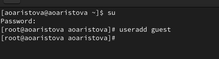{#fig:001 width=70%}

## Выполнение лабораторной работы

Задаю пароль для нового пользователя guest с помощью команды *passwd guest*:

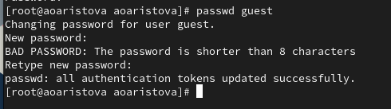{#fig:002 width=70%}

## Выполнение лабораторной работы

Перезагружаю машину и вижу возможность войти от имени пользователя guest, делаю это:

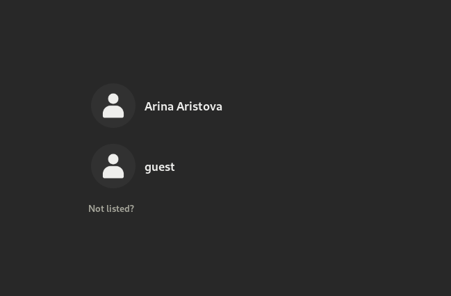{#fig:003 width=60%}

## Выполнение лабораторной работы

С помощью  команды *pwd* определяю директорию, в которой нахожусь. Сравнив результат с приглашением командной строки
выявляю: они одинаковы. Я нахожусь в домашней директории.

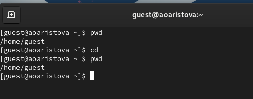{#fig:004 width=70%}

## Выполнение лабораторной работы

С помощью команды *whoami* определяю имя пользователя, от имени которого произошел вход.

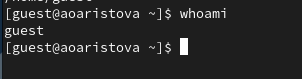{#fig:005 width=70%}

## Выполнение лабораторной работы

Командой *id* уточняю имя пользователя, его группы куда входит пользователь. 

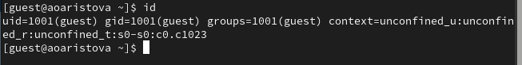{#fig:006 width=70%}

## Выполнение лабораторной работы

Затем выполняю команду *groups*, чтобы узнать информацию о группах. Видим, что полученная информация сходится 
с полученной в прошлом пункте информации о группах.

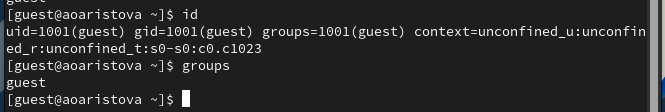{#fig:007 width=70%}

## Выполнение лабораторной работы

Сравнив полученный результат с приглашением командной строки, убеждаемся в том, что в приглашении указано имя пользователя.

Просматриваю файл */etc/passwd* командой *cat /etc/passwd*
Нахожу в нём свою учётную запись. Определяю uid пользователя.
Определяю gid пользователя. 

## Выполнение лабораторной работы

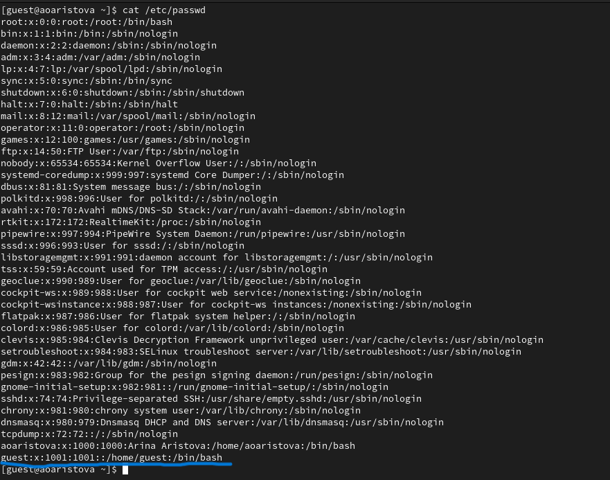{#fig:008 width=60%}

## Выполнение лабораторной работы

Для более понятного результата использую команду grep:

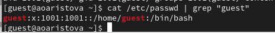{#fig:009 width=70%}

## Выполнение лабораторной работы

Определяю существующие в системе директории с помощью команды *ls -l /home/*:

На директория установлены следующие права: владельцы могут читать, записывать и выполнять, 
а группа и остальные ничего из перечисленного.

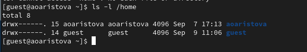{#fig:010 width=70%}

## Выполнение лабораторной работы

Проверяю, какие расширенные атрибуты установлены на поддиректориях, находящихся в директории /home, командой:
*lsattr /home*:
Удалось ли вам увидеть расширенные атрибуты директории? - НЕТ
Удалось ли вам увидеть расширенные атрибуты директорий других
пользователей? - НЕТ

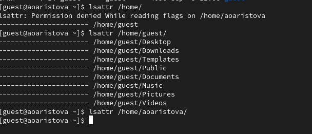{#fig:011 width=70%}

## Выполнение лабораторной работы

Затем создаю в домашенм каталоге каталог dir1.

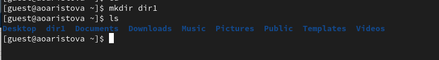{#fig:012 width=70%}

## Выполнение лабораторной работы

Затем с помощью команды *ls* я проверяю права доступа на эту директорию:
владелец может читать, записывать выполнять, члены группы только записывать и выполнять, а остальыне только выполнять
С помощью команды *lsattr* узнаем о расширенных атрибутах.

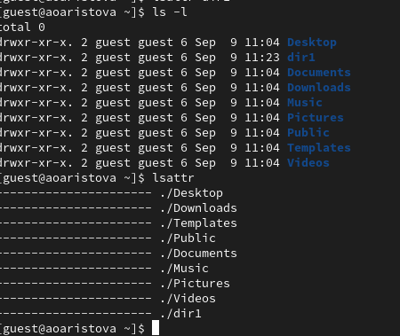{#fig:013 width=40%}

## Выполнение лабораторной работы

С помощью команды *chmod 000 dir1* снимаем с директории dir1, а затем проверяю выполненые действия 
с помощь ю команды *ls -l*.

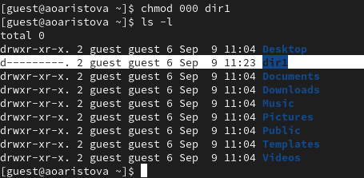{#fig:014 width=70%}

## Выполнение лабораторной работы

Пытаюсь создать в директории dir1 файл file1 командой
*echo "test" > /home/guest/dir1/file1*. Я получаю отказ в выполнении этого дейтвия, так как даже у владельца
директории нет прав на запись. Файл дейсвтительно не находится внутри директории.

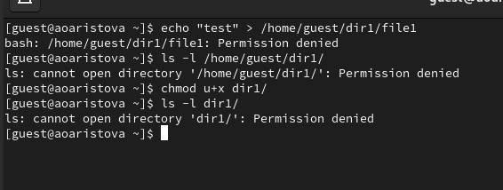{#fig:015 width=70%}

## Выполнение лабораторной работы

Проделываю те же действия, предварительно дав пользователю права на чтение и запись директории, 
таким образом создание файла заканчивается успехом. Эти действия выполняются для последующего заполнения таблицы. 

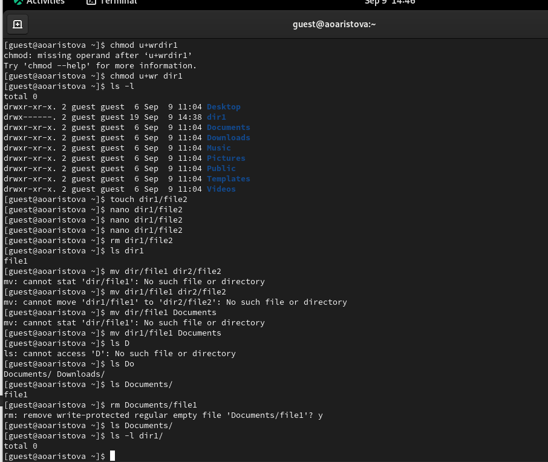{#fig:016 width=40%}

## Выполнение лабораторной работы

Теперь заполним таблицу "Установленные права и разрешенные действия". 

| Права директории | Права файла     | Соз-дание файла | Удале-ние файла| За-пись в файл| Чте-ние файла | Смена директории | Просмотр файлов в директории | Переи-менова-ние файла | Смена атрибутов файла |
|------------------|-----------------|-----------------|----------------|---------------|---------------|------------------|------------------------------|------------------------|-----------------------|
| d (000)          | (000)           | -               | -              | -             | -             | -                | -                            | -                      | -                     |
| d--x------ (100) | (000)           | -               | -              | -             | -             | +                | -                            | -                      | -                     |
| drwx------ (700) | (700)           | +               | +              | +             | +             | +                | +                            | +                      | +                     |
  

## Вывод

В ходе выполнения лабораторной работы мною были получены навыки работы в консоли с атрибутами файлов,
закреплены теоретические основы дискреционного разграничения доступа в современных системах с 
открытым кодом на базе ОС Linux.
