---
## Front matter
title: "Отчёт по лабораторной работе 2"
subtitle: "Дискреционное разграничение прав в Linux. Основные атрибуты"
author: "Аристова Арина Олеговна"

## Generic otions
lang: ru-RU
toc-title: "Содержание"

## Bibliography
bibliography: bib/cite.bib
csl: pandoc/csl/gost-r-7-0-5-2008-numeric.csl

## Pdf output format
toc: true # Table of contents
toc-depth: 2
lof: true # List of figures
lot: true # List of tables
fontsize: 12pt
linestretch: 1.5
papersize: a4
documentclass: scrreprt
## I18n polyglossia
polyglossia-lang:
  name: russian
  options:
	- spelling=modern
	- babelshorthands=true
polyglossia-otherlangs:
  name: english
## I18n babel
babel-lang: russian
babel-otherlangs: english
## Fonts
mainfont: PT Serif
romanfont: PT Serif
sansfont: PT Sans
monofont: PT Mono
mainfontoptions: Ligatures=TeX
romanfontoptions: Ligatures=TeX
sansfontoptions: Ligatures=TeX,Scale=MatchLowercase
monofontoptions: Scale=MatchLowercase,Scale=0.9
## Biblatex
biblatex: true
biblio-style: "gost-numeric"
biblatexoptions:
  - parentracker=true
  - backend=biber
  - hyperref=auto
  - language=auto
  - autolang=other*
  - citestyle=gost-numeric
## Pandoc-crossref LaTeX customization
figureTitle: "Рис."
tableTitle: "Таблица"
listingTitle: "Листинг"
lofTitle: "Список иллюстраций"
lotTitle: "Список таблиц"
lolTitle: "Листинги"
## Misc options
indent: true
header-includes:
  - \usepackage{indentfirst}
  - \usepackage{float} # keep figures where there are in the text
  - \floatplacement{figure}{H} # keep figures where there are in the text
---

# Цель работы

Получение практических навыков работы в консоли с атрибутами файлов, закрепление теоретических 
основ дискреционного разграничения доступа в современных системах с открытым кодом на базе ОС Linux.

# Выполнение лабораторной работы

Запускаю виртуальную машину, настроенную в рамках предыдущей плабораторной работы. Открываю  терминал 
и, используя учетную запись администратора создаю учетную запись пользователя с помощью команды: *useradd guest*

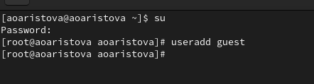{#fig:001 width=90%}

Задаю пароль для нового пользователя guest с помощью команды *passwd guest*:

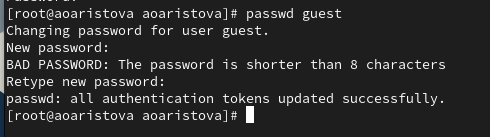{#fig:002 width=90%}

Перезагружаю машину и вижу возможность войти от имени пользователя guest, делаю это:

{#fig:003 width=90%}

С помощью  команды *pwd* определяю директорию, в которой нахожусь. Сравнив результат с приглашением командной строки
выявляю: они одинаковы. Я нахожусь в домашней директории.

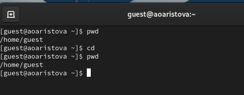{#fig:004 width=90%}

С помощью команды *whoami* определяю имя пользователя, от имени которого произошел вход.

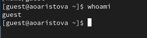{#fig:005 width=90%}

Командой *id* уточняю имя пользователя, его группы куда входит пользователь. 

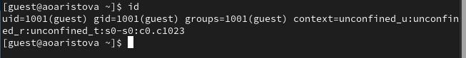{#fig:006 width=90%}

Затем выполняю команду *groups*, чтобы узнать информацию о группах. Видим, что полученная информация сходится 
с полученной в прошлом пункте информации о группах.

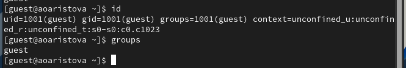{#fig:007 width=90%}

Сравнив полученный результат с приглашением командной строки, убеждаемся в том, что в приглашении указано имя пользователя.

Просматриваю файл */etc/passwd* командой *cat /etc/passwd*
Нахожу в нём свою учётную запись. Определяю uid пользователя.
Определяю gid пользователя. 

{#fig:008 width=90%}

Для более понятного результата использую команду grep:

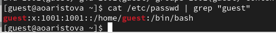{#fig:009 width=90%}

Определяю существующие в системе директории с помощью команды *ls -l /home/*:

На директория установлены следующие права: владельцы могут читать, записывать и выполнять, 
а группа и остальные ничего из перечисленного.

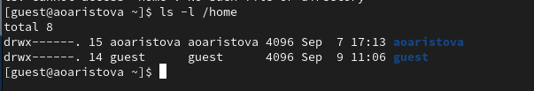{#fig:010 width=90%}

Проверяю, какие расширенные атрибуты установлены на поддиректориях, находящихся в директории /home, командой:
*lsattr /home*:
Удалось ли вам увидеть расширенные атрибуты директории? - НЕТ
Удалось ли вам увидеть расширенные атрибуты директорий других
пользователей? - НЕТ

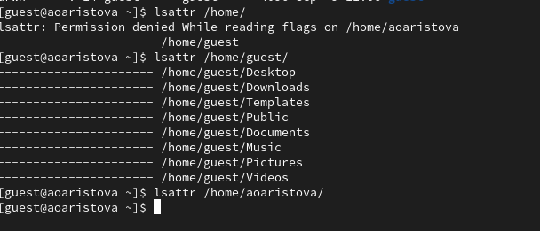{#fig:011 width=90%}

Затем создаю в домашенм каталоге каталог dir1.

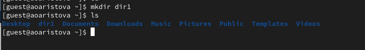{#fig:012 width=90%}

Затем с помощью команды *ls* я проверяю права доступа на эту директорию:
владелец может читать, записывать выполнять, члены группы только записывать и выполнять, а остальыне только выполнять

С помощью команды *lsattr* узнаем о расширенных атрибутах.

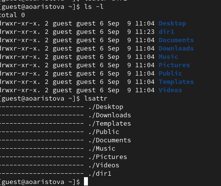{#fig:013 width=90%}

С помощью команды *chmod 000 dir1* снимаем с директории dir1, а затем проверяю выполненые действия 
с помощь ю команды *ls -l*.

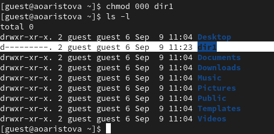{#fig:014 width=90%}

Пытаюсь создать в директории dir1 файл file1 командой
*echo "test" > /home/guest/dir1/file1*. Я получаю отказ в выполнении этого дейтвия, так как даже у владельца
директории нет прав на запись. Файл дейсвтительно не находится внутри директории.

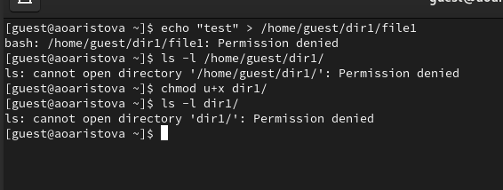{#fig:015 width=90%}

Проделываю те же действия, предварительно дав пользователю права на чтение и запись директории, 
таким образом создание файла заканчивается успехом. Эти действия выполняются для последующего заполнения таблицы. 

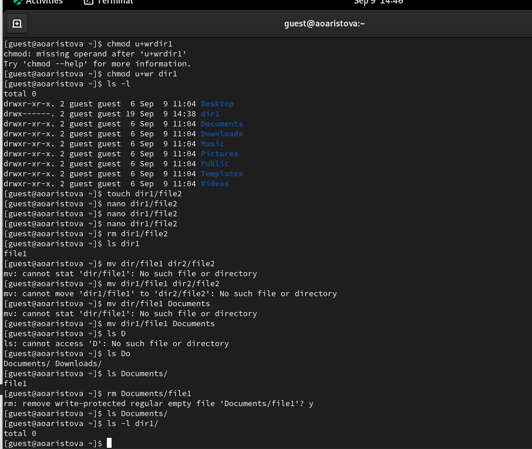{#fig:016 width=90%}

Теперь заполним таблицу "Установленные права и разрешенные действия". 

| Права директории | Права файла     | Соз-дание файла | Удале-ние файла| За-пись в файл| Чте-ние файла | Смена директории | Просмотр файлов в директории | Переи-менова-ние файла | Смена атрибутов файла |
|------------------|-----------------|-----------------|----------------|---------------|---------------|------------------|------------------------------|------------------------|-----------------------|
| d (000)          | (000)           | -               | -              | -             | -             | -                | -                            | -                      | -                     |
| d--x------ (100) | (000)           | -               | -              | -             | -             | +                | -                            | -                      | -                     |
| drwx------ (700) | (700)           | +               | +              | +             | +             | +                | +                            | +                      | +                     |
  

# Выводы

В ходе выполнения лабораторной работы мною были получены навыки работы в консоли с атрибутами файлов,
закреплены теоретические основы дискреционного разграничения доступа в современных системах с 
открытым кодом на базе ОС Linux.

# Список литературы{.unnumbered}

- Описание лабораторной работы 
