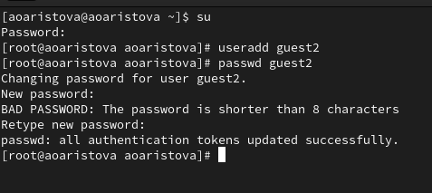
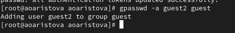
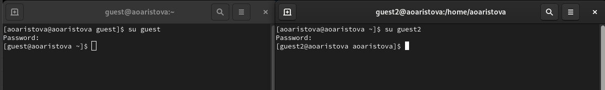
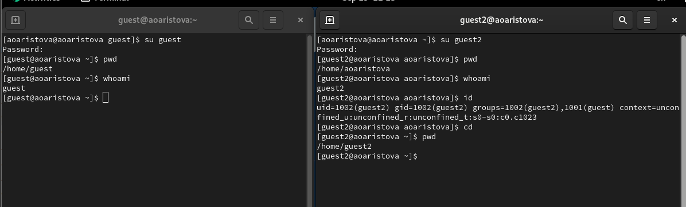
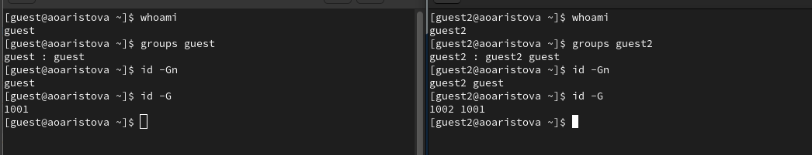
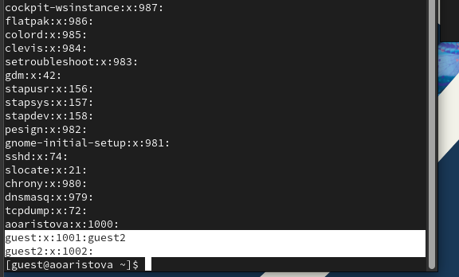
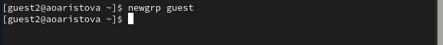
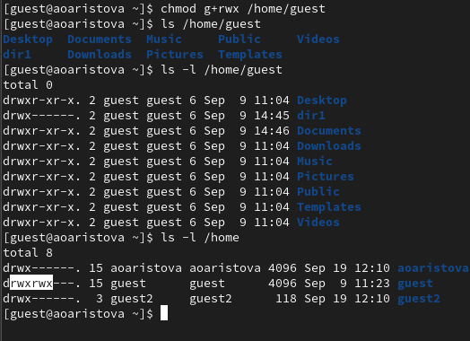
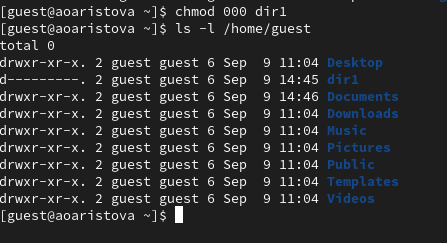

---
## Front matter
lang: ru-RU
title: Презентация к лабораторной работе 3
subtitle: Дискреционное разграничение прав в Linux. Два пользователя
author:
  Аристова А.О.
institute:
  - Российский университет дружбы народов, Москва, Россия
date: 19 сентября 2024

## i18n babel
babel-lang: russian
babel-otherlangs: english

## Formatting pdf
toc: false
toc-title: Содержание
slide_level: 2
aspectratio: 169
section-titles: true
theme: metropolis
header-includes:
 - \metroset{progressbar=frametitle,sectionpage=progressbar,numbering=fraction}
 - '\makeatletter'
 - '\beamer@ignorenonframefalse'
 - '\makeatother'
---

## Докладчик

:::::::::::::: {.columns align=center}
::: {.column width="70%"}

  * Аристова Арина Олеговна
  * студентка группы НФбд-01-21
  * Российский университет дружбы народов
  * [1032216433@rudn.ru](mailto:1032216433@rudn.ru)
  * <https://github.com/aoaristova>

:::
::: {.column width="30%"}

:::
::::::::::::::

## Цель работы

Получение практических навыков работы в консоли с атрибутами файлов для групп пользователей.

# Выполнение лабораторной работы

## Выполнение лабораторной работы

Запускаю виртуальную машину, настроенную в рамках предыдущей плабораторной работы. Открываю  терминал 
и, используя учетную запись администратора создаю учетную запись пользователя с помощью команды: *useradd guest2*, а также 
задаю пароль для нового пользователя.

{#fig:001 width=70%}

## Выполнение лабораторной работы

Добавляю пользователя guest2 в группу guest с помощью следующей команды *gpasswd -a guest2 guest*:

{#fig:002 width=90%}

## Выполнение лабораторной работы

Осуществляю вход в систему от двух пользователей на двух разных консолях: *guest* на первой консоли 
и *guest2* на второй консоли:

{#fig:003 width=90%}

## Выполнение лабораторной работы

С помощью команды *pwd* выясняю, в какой директории нахожусь, результат сравним с приглашением омандной строки.

{#fig:004 width=90%}

## Выполнение лабораторной работы

Уточняю имя пользователя, его группу, кто входит в неё
и к каким группам принадлежит он сам с помощью команд
*groups guest* и *groups guest2*, в какие группы входят пользователи *guest* и *guest2*. На следующем изображении 
можем сравнить вывод команды *groups* с выводом команд
*id -Gn* (выводится название группы) и id -G (выводится номер код группы).

{#fig:005 width=90%}

## Выполнение лабораторной работы

Сравниваю полученную информацию с выводом содержимого файла */etc/group* с помощью команды * cat /etc/group*
Он содержит имя группы, информацию о ее членах и код группы.

{#fig:006 width=50%}

## Выполнение лабораторной работы

От имени пользователя *guest2* выполняю регистрацию пользователя
*guest2* в группе *guest* командой *newgrp guest*:

{#fig:007 width=90%}

## Выполнение лабораторной работы

От имени пользователя *guest* изменяю права директории */home/guest*,
разрешив все действия для пользователей группы с помощью команды *chmod g+rwx /home/guest* и проверяю
правильность выполненных действий с помощью команды *ls -l*:

{#fig:008 width=50%}

## Выполнение лабораторной работы

От имени пользователя *guest* снимаю с директории */home/guest/dir1*все атрибуты командой
*chmod 000 dirl* и проверяю правильность снятия атрибутов:

{#fig:009 width=70%}

## Выполнение лабораторной работы

Затем мне было необходимо заполнить следующую таблицу: 

| Операция               | Минимальные права на директорию | Минимальные права на файл | 
|------------------------|---------------------------------|----------------------------|
| Создание файла         | d----wx--- (030)                | --------- (000)            | 
| Удаление файла         | d----wx--- (030)                | --------- (000)            | 
| Чтение файла           | d---r----- (040)                | ---r----- (040)            | 
| Запись в файл          | d-----x--- (010)                | ----w---- (020)            |
| Переименование файла   | d----wx--- (030)                | --------- (000)            | 
| Создание поддиректории | d----wx--- (030)                | --------- (000)            | 
| Удаление поддиректории | d----wx--- (030)                | --------- (000)            | 

## Вывод

В ходе выполнения лабораторной работы мною были получены навыки работы в консоли с атрибутами файлов
для групп пользователей, закреплены теоретические основы дискреционного разграничения доступа в 
современных системах с открытым кодом на базе ОС Linux.