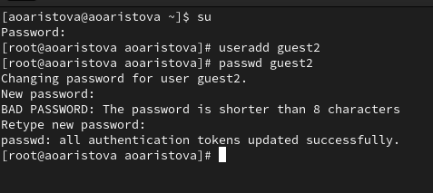
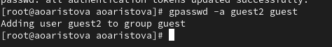
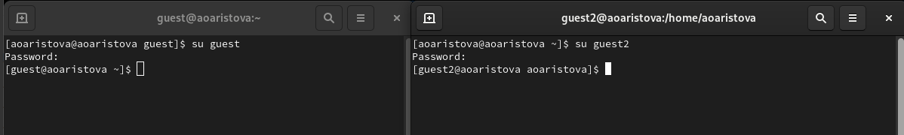
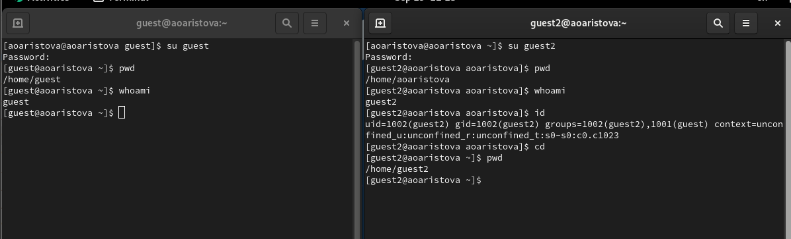
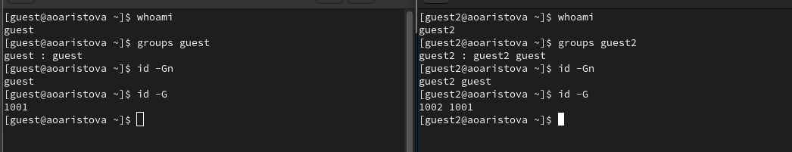
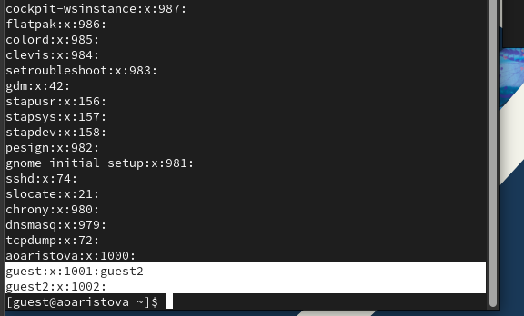
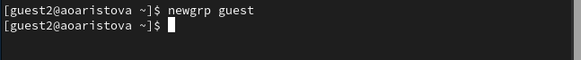
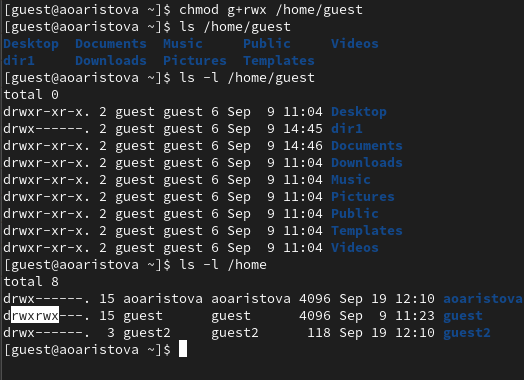
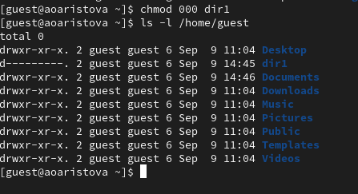

---
## Front matter
title: "Отчёт по лабораторной работе 3"
subtitle: "Дискреционное разграничение прав в Linux. Два пользователя"
author: "Аристова Арина Олеговна"

## Generic otions
lang: ru-RU
toc-title: "Содержание"

## Bibliography
bibliography: bib/cite.bib
csl: pandoc/csl/gost-r-7-0-5-2008-numeric.csl

## Pdf output format
toc: true # Table of contents
toc-depth: 2
lof: true # List of figures
lot: true # List of tables
fontsize: 12pt
linestretch: 1.5
papersize: a4
documentclass: scrreprt
## I18n polyglossia
polyglossia-lang:
  name: russian
  options:
	- spelling=modern
	- babelshorthands=true
polyglossia-otherlangs:
  name: english
## I18n babel
babel-lang: russian
babel-otherlangs: english
## Fonts
mainfont: PT Serif
romanfont: PT Serif
sansfont: PT Sans
monofont: PT Mono
mainfontoptions: Ligatures=TeX
romanfontoptions: Ligatures=TeX
sansfontoptions: Ligatures=TeX,Scale=MatchLowercase
monofontoptions: Scale=MatchLowercase,Scale=0.9
## Biblatex
biblatex: true
biblio-style: "gost-numeric"
biblatexoptions:
  - parentracker=true
  - backend=biber
  - hyperref=auto
  - language=auto
  - autolang=other*
  - citestyle=gost-numeric
## Pandoc-crossref LaTeX customization
figureTitle: "Рис."
tableTitle: "Таблица"
listingTitle: "Листинг"
lofTitle: "Список иллюстраций"
lotTitle: "Список таблиц"
lolTitle: "Листинги"
## Misc options
indent: true
header-includes:
  - \usepackage{indentfirst}
  - \usepackage{float} # keep figures where there are in the text
  - \floatplacement{figure}{H} # keep figures where there are in the text
---

# Цель работы

Получение практических навыков работы в консоли с атрибутами файлов для групп пользователей.

# Выполнение лабораторной работы

Запускаю виртуальную машину, настроенную в рамках предыдущей плабораторной работы. Открываю  терминал 
и, используя учетную запись администратора создаю учетную запись пользователя с помощью команды: *useradd guest2*, а также 
задаю пароль для нового пользователя.

{#fig:001 width=90%}

Добавляю пользователя guest2 в группу guest с помощью следующей команды *gpasswd -a guest2 guest*:

{#fig:002 width=90%}

Осуществляю вход в систему от двух пользователей на двух разных консолях: *guest* на первой консоли 
и *guest2* на второй консоли:

{#fig:003 width=90%}

С помощью команды *pwd* выясняю, в какой директории нахожусь, результат сравним с приглашением омандной строки.

{#fig:004 width=90%}

Уточняю имя пользователя, его группу, кто входит в неё
и к каким группам принадлежит он сам с помощью команд
*groups guest* и *groups guest2*, в какие группы входят пользователи *guest* и *guest2*. На следующем изображении 
можем сравнить вывод команды *groups* с выводом команд
*id -Gn* (выводится название группы) и id -G (выводится номер код группы).

{#fig:005 width=90%}

Сравниваю полученную информацию с выводом содержимого файла */etc/group* с помощью команды * cat /etc/group*
Он содержит имя группы, информацию о ее членах и код группы.

{#fig:006 width=90%}

От имени пользователя *guest2* выполняю регистрацию пользователя
*guest2* в группе *guest* командой *newgrp guest*:

{#fig:007 width=90%}

От имени пользователя *guest* изменяю права директории */home/guest*,
разрешив все действия для пользователей группы с помощью команды *chmod g+rwx /home/guest* и проверяю
правильность выполненных действий с помощью команды *ls -l*:

{#fig:008 width=90%}

От имени пользователя *guest* снимаю с директории */home/guest/dir1*все атрибуты командой
*chmod 000 dirl* и проверяю правильность снятия атрибутов:

{#fig:009 width=90%}

Затем мне было необходимо заполнить следующую таблицу: 

| Операция               | Минимальные права на директорию | Минимальные права на файл | 
|------------------------|---------------------------------|----------------------------|
| Создание файла         | d----wx--- (030)                | --------- (000)            | 
| Удаление файла         | d----wx--- (030)                | --------- (000)            | 
| Чтение файла           | d---r----- (040)                | ---r----- (040)            | 
| Запись в файл          | d-----x--- (010)                | ----w---- (020)            |
| Переименование файла   | d----wx--- (030)                | --------- (000)            | 
| Создание поддиректории | d----wx--- (030)                | --------- (000)            | 
| Удаление поддиректории | d----wx--- (030)                | --------- (000)            | 

# Выводы

В ходе выполнения лабораторной работы мною были получены навыки работы в консоли с атрибутами файлов
для групп пользователей, закреплены теоретические основы дискреционного разграничения доступа в 
современных системах с открытым кодом на базе ОС Linux.

# Список литературы{.unnumbered}

- Описание лабораторной работы 

