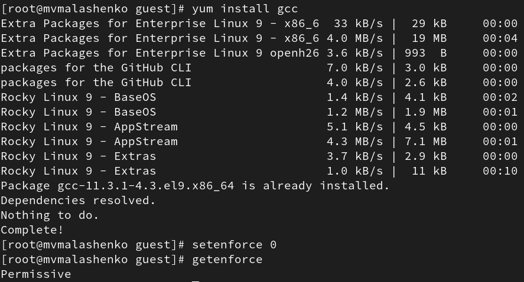
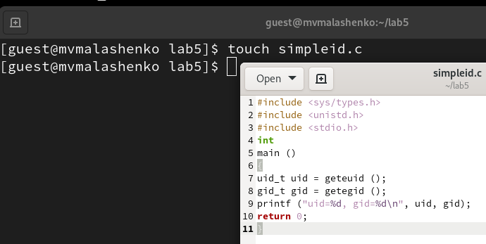
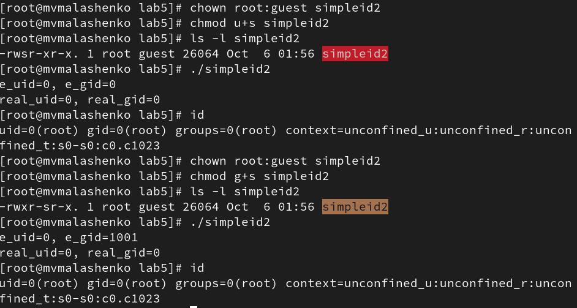
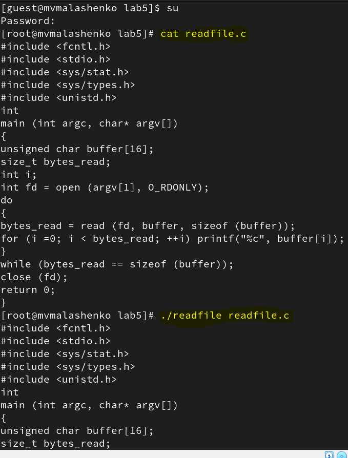
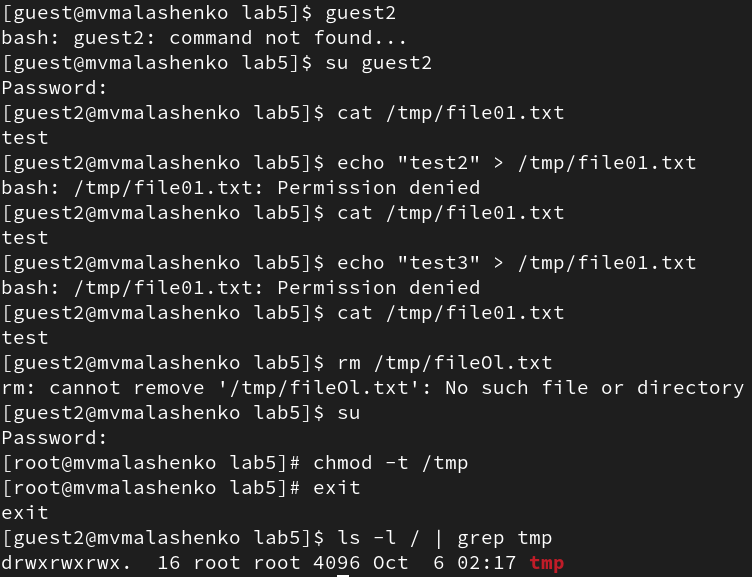
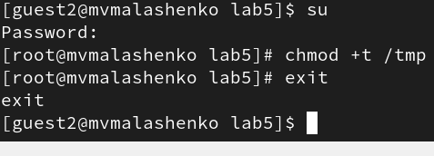

---
## Front matter
lang: ru-RU
title: Презентация к лабораторной работе 5
subtitle: Дискреционное разграничение прав в Linux. Исследование влияния дополнительных атрибутов
author:
  Аристова А.О.
institute:
  - Российский университет дружбы народов имени Патриса Лумумбы, Москва, Россия
date: 05 октября 2024

## i18n babel
babel-lang: russian
babel-otherlangs: english

## Formatting pdf
toc: false
toc-title: Содержание
slide_level: 2
aspectratio: 169
section-titles: true
theme: metropolis
header-includes:
 - \metroset{progressbar=frametitle,sectionpage=progressbar,numbering=fraction}
 - '\makeatletter'
 - '\beamer@ignorenonframefalse'
 - '\makeatother'
---

## Докладчик

:::::::::::::: {.columns align=center}
::: {.column width="70%"}

  * Аристова Арина Олеговна
  * студентка группы НФбд-01-21
  * Российский университет дружбы народов имени Патриса Лумумбы
  * [1032216433@rudn.ru](mailto:1032216433@rudn.ru)
  * <https://github.com/aoaristova>

:::
::: {.column width="30%"}

:::
::::::::::::::

## Цель лабораторной работы

- Изучение механизмов изменения идентификаторов, применения
SetUID- и Sticky-битов. Получение практических навыков работы в консоли с дополнительными атрибутами. Рассмотрение работы механизма смены идентификатора процессов пользователей, а также влияние бита Sticky на запись и удаление файлов

## Теоретическая справка (1)

**1. Дополнительные атрибуты файлов Linux** 

В Linux существует три основных вида прав — право на чтение (read), запись (write) и выполнение (execute), а также три категории пользователей, к которым они могут применяться — владелец файла (user), группа владельца (group) и все остальные (others). Но, кроме прав чтения, выполнения и записи, есть еще три дополнительных атрибута. [1]

## Теоретическая справка (2)

**2. Компилятор GCC** 

GСС - это свободно доступный оптимизирующий компилятор для языков C, C++.
Собственно программа gcc это некоторая надстройка над группой компиляторов, которая способна анализировать имена файлов, передаваемые ей в качестве аргументов, и определять, какие действия необходимо выполнить. Файлы с расширением .cc или .C рассматриваются, как файлы на языке C++, файлы с расширением .c как программы на языке C, а файлы c расширением .o считаются объектными. [2]

# Ход выполнения лабораторной работы

## 5.2.1. Подготовка лабораторного стенда

{ #fig:001 width=70% height=70% }

## 5.3.1 Создание программы

Создали программу simpleid.c

{ #fig:002 width=70% height=70% }

## 5.3.1 Создание программы

Скомплилировали и выполнили программу simpleid. Затем выполнили системную программу id и сравнили полученные результаты

{ #fig:003 width=70% height=70% }

## 5.3.1 Создание программы

Усложнили программу, добавив вывод действительных идентификаторов

{ #fig:004 width=70% height=70% }

## 5.3.1 Создание программы

Скомплилировали и выполнили программу simpleid2

{ #fig:005 width=70% height=70% }

## 5.3.1 Создание программы

От имени суперпользователя выполнили команды и проверили правильность установки новых атрибутов и смены
владельца файла. Запустили simpleid2 и id.
Сравнили результаты. Проделали то же самое относительно SetGID-бита

{ #fig:006 width=70% height=70% }

## 5.3.1 Создание программы

Скомплилировали программу readfile.c

{ #fig:007 width=70% height=70% }

## 5.3.1 Создание программы

Сменили владельца у файла и изменили права так, чтобы только суперпользователь мог прочитать его, a guest не мог

{ #fig:008 width=70% height=70% }

## 5.3.1 Создание программы

Проверили, что guest не может прочитать файл.
Сменили у программы readfile владельца и установили SetU’D-бит. Проверили, может ли программа readfile прочитать файл readfile.c, файл /etc/shadow

{ #fig:009 width=70% height=70% }

## 5.3.1 Создание программы

От имени суперпользователя все предыдущие команды удается выполнить

{ #fig:010 width=70% height=70% }

## 5.3.2. Исследование Sticky-бита

Выяснили, установлен ли атрибут Sticky на директории /tmp,
создали файл file01.txt со словом test.
Просмотрели атрибуты у только что созданного файла и разрешили чтение и запись для категории пользователей «все остальные»

{ #fig:012 width=70% height=70% }

## 5.3.2. Исследование Sticky-бита

От guest2 попробовали прочесть файл, дозаписать слово test2, затем записать слово test3, стерев при этом всю имеющуюся в файле информацию. Попробовали удалить файл. Этого сделать не удалось.

Повысили свои права до суперпользователя и сняли атрибут t с директории /tmp. От guest2 проверили, что атрибута t у директории /tmp нет

{ #fig:013 width=70% height=70% }

## 5.3.2. Исследование Sticky-бита

Повторили предыдущие шаги. При повторении всё получилось.
Удалось удалить файл от имени пользователя, не являющегося его владельцем.

Повысили свои права до суперпользователя и вернули атрибут t на директорию /tmp

{ #fig:015 width=70% height=70% }

# Вывод

## Вывод

- Были изучены механизмы изменения идентификаторов и применения SetUID- и Sticky-битов. Получены практические навыки работы в консоли с дополнительными атрибутами. Были рассмотрены работа механизма смены идентификатора процессов пользователей, а также влияние бита Sticky на запись и удаление файлов

# Список литературы. Библиография

- Описание лабораторной работы
