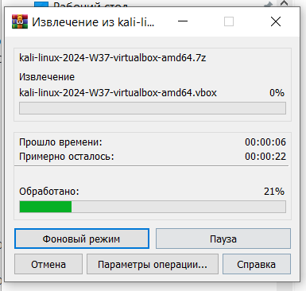
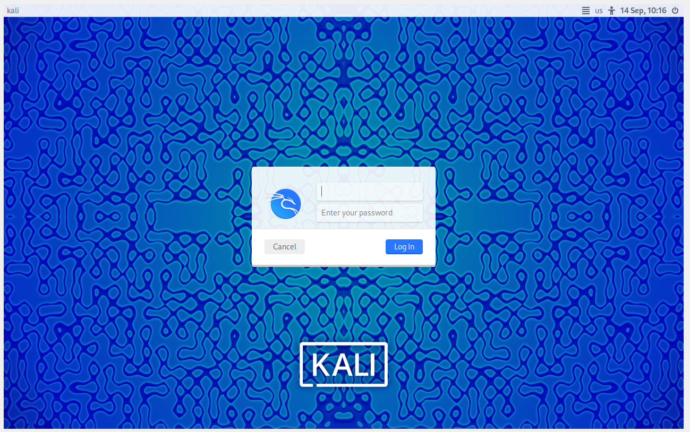
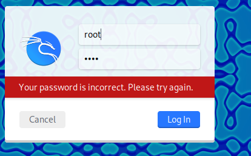

---
## Front matter
lang: ru-RU
title: Презентация к 1 этапу индивидуального проекта
subtitle: Установка Kali Linux
author:
  Аристова А.О.
institute:
  - Российский университет дружбы народов, Москва, Россия
date: 14 сентября 2024

## i18n babel
babel-lang: russian
babel-otherlangs: english

## Formatting pdf
toc: false
toc-title: Содержание
slide_level: 2
aspectratio: 169
section-titles: true
theme: metropolis
header-includes:
 - \metroset{progressbar=frametitle,sectionpage=progressbar,numbering=fraction}
 - '\makeatletter'
 - '\beamer@ignorenonframefalse'
 - '\makeatother'
---

## Докладчик

:::::::::::::: {.columns align=center}
::: {.column width="70%"}

  * Аристова Арина Олеговна
  * студентка группы НФбд-01-21
  * Российский университет дружбы народов
  * [1032216433@rudn.ru](mailto:1032216433@rudn.ru)
  * <https://github.com/aoaristova>

:::
::: {.column width="30%"}

:::
::::::::::::::

## Задание

Установить дистрибутив Kali Linux на виртуальную машину для дальнейшей работы над индивидуальным проектом.

# Выполнение работы

## Выполнение 1 этапа проекта

Захожу на сайт Kali Linux и скачиваю необходимые для дальнейшей работы файлы:

{#fig:001 width=40%}

## Выполнение 1 этапа проекта

Затем необходимо разархивировать скачанное:

{#fig:002 width=40%}

## Выполнение 1 этапа проекта

Добавляю новую виртуальную машину и выбираю скачанный файл.

Затем запускаю получившуюся виртуальную машину:

{#fig:003 width=40%}

## Выполнение 1 этапа проекта

Далее необходимо ввести логин и пароль, заданные по умолчанию:

{#fig:004 width=65%}

## Выполнение 1 этапа проекта

В описании первого этапа индивидуального проекта указано, что:

- логин по умолчанию: *root*

- пароль по умолчанию: *toor*.

## Выполнение 1 этапа проекта

Однако при вводе этих данных получается ошибка:

{#fig:005 width=65%}

## Выполнение 1 этапа проекта

Пользовательская политика Kali Linux претерпела изменения после выхода версии 2020.1. 
Я использовала версию после 2020.1, поэтому ввожу следующие данные: 

- логин по умолчанию: *kali*

- пароль по умолчанию: *kali*.

И вход выполнен!

## Выполнение 1 этапа проекта

{#fig:006 width=65%}

## Выполнение 1 этапа проекта

Теперь захожу в терминал и пробую выполнить базовые операции в терминале,  чтобы убедиться, что все работает!

{#fig:007 width=45%}

## Вывод

В результате выполнения первого этапа индиивидуального проекта мною был установлен дистрибутив 
Kali Linux на виртуальную машину для дальнейшей работы над индивидуальным проектом.

