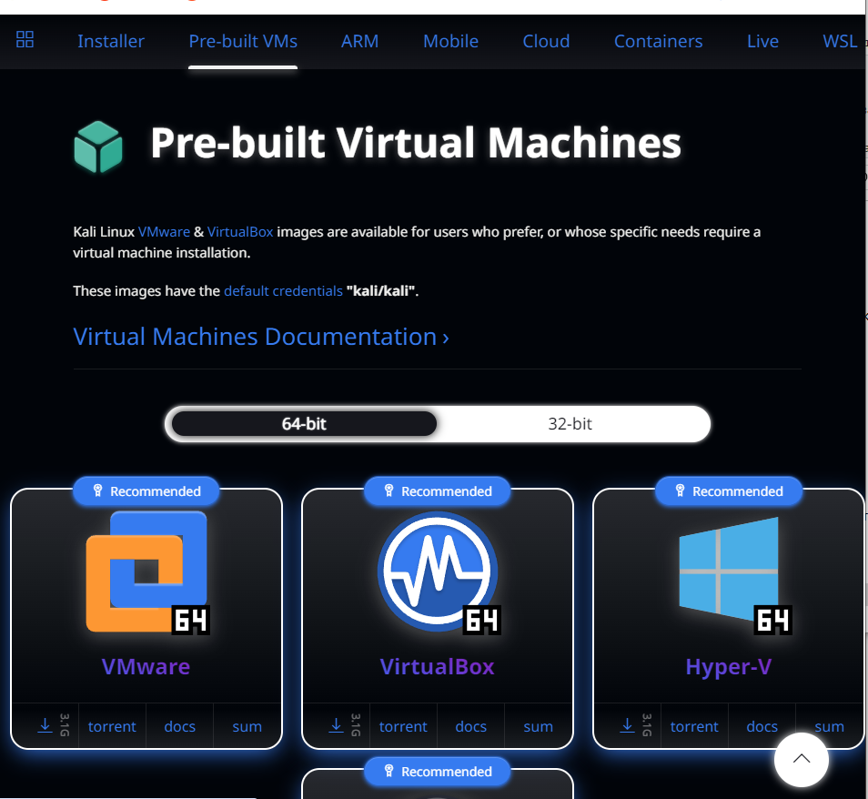
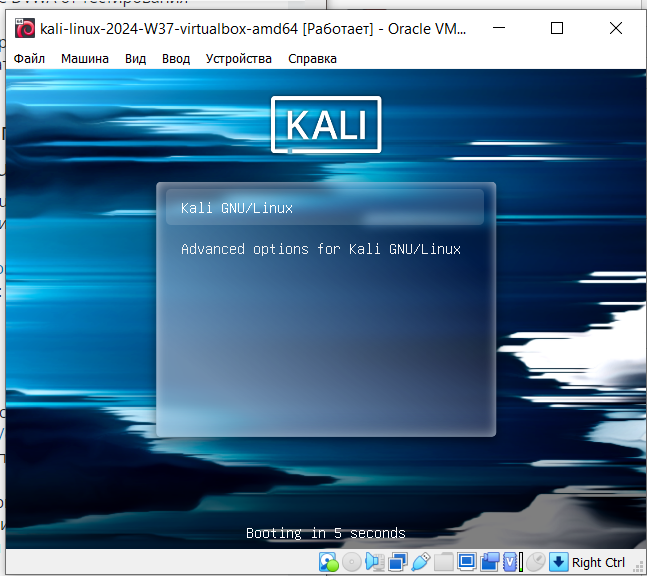
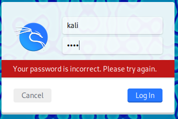

---
## Front matter
title: "Отчёт по 1 этапу индивидуального проекта"
subtitle: "Установка Kali Linux"
author: "Аристова Арина Олеговна"

## Generic otions
lang: ru-RU
toc-title: "Содержание"

## Bibliography
bibliography: bib/cite.bib
csl: pandoc/csl/gost-r-7-0-5-2008-numeric.csl

## Pdf output format
toc: true # Table of contents
toc-depth: 2
lof: true # List of figures
lot: true # List of tables
fontsize: 12pt
linestretch: 1.5
papersize: a4
documentclass: scrreprt
## I18n polyglossia
polyglossia-lang:
  name: russian
  options:
	- spelling=modern
	- babelshorthands=true
polyglossia-otherlangs:
  name: english
## I18n babel
babel-lang: russian
babel-otherlangs: english
## Fonts
mainfont: PT Serif
romanfont: PT Serif
sansfont: PT Sans
monofont: PT Mono
mainfontoptions: Ligatures=TeX
romanfontoptions: Ligatures=TeX
sansfontoptions: Ligatures=TeX,Scale=MatchLowercase
monofontoptions: Scale=MatchLowercase,Scale=0.9
## Biblatex
biblatex: true
biblio-style: "gost-numeric"
biblatexoptions:
  - parentracker=true
  - backend=biber
  - hyperref=auto
  - language=auto
  - autolang=other*
  - citestyle=gost-numeric
## Pandoc-crossref LaTeX customization
figureTitle: "Рис."
tableTitle: "Таблица"
listingTitle: "Листинг"
lofTitle: "Список иллюстраций"
lotTitle: "Список таблиц"
lolTitle: "Листинги"
## Misc options
indent: true
header-includes:
  - \usepackage{indentfirst}
  - \usepackage{float} # keep figures where there are in the text
  - \floatplacement{figure}{H} # keep figures where there are in the text
---

# Задание

Установить дистрибутив Kali Linux на виртуальную машину для дальнейшей работы над индивидуальным проектом.

# Выполнение лабораторной работы

Захожу на сайт Kali Linux и скачиваю необходимые для дальнейшей работы файлы:

{#fig:001 width=90%}

Затем необходимо разархивировать скачанное:

{#fig:002 width=70%}

Добавляю новую виртуальную машину и выбираю скачанный файл.

Затем запускаю получившуюся виртуальную машину:

{#fig:003 width=70%}

Далее необходимо ввести логин и пароль, заданные по умолчанию:

{#fig:004 width=70%}

В описании первого этапа индивидуального проекта указано, что:

- логин по умолчанию: *root*

- пароль по умолчанию: *toor*.

Однако при вводе этих данных получается ошибка:

{#fig:005 width=70%}

Пользовательская политика Kali Linux претерпела изменения после выхода версии 2020.1. 
Я использовала версию после 2020.1, поэтому ввожу следующие данные: 

- логин по умолчанию: *kali*

- пароль по умолчанию: *kali*.

И вход выполнен!

{#fig:006 width=70%}

Теперь захожу в терминал и пробую выполнить базовые операции в терминале,  чтобы убедиться, что все работает!

{#fig:007 width=70%}

# Выводы

В результате выполнения первого этапа индиивидуального проекта мною был установлен дистрибутив 
Kali Linux на виртуальную машину для дальнейшей работы над индивидуальным проектом.
