---
## Front matter
lang: ru-RU
title: Презентация к 4 этапу индивидуального проекта
subtitle: Установка DVWA
author:
  Аристова А.О.
institute:
  - Российский университет дружбы народов, Москва, Россия
date: 05 октября 2024

## i18n babel
babel-lang: russian
babel-otherlangs: english

## Formatting pdf
toc: false
toc-title: Содержание
slide_level: 2
aspectratio: 169
section-titles: true
theme: metropolis
header-includes:
 - \metroset{progressbar=frametitle,sectionpage=progressbar,numbering=fraction}
 - '\makeatletter'
 - '\beamer@ignorenonframefalse'
 - '\makeatother'
---

## Докладчик

:::::::::::::: {.columns align=center}
::: {.column width="70%"}

  * Аристова Арина Олеговна
  * студентка группы НФбд-01-21
  * Российский университет дружбы народов
  * [1032216433@rudn.ru](mailto:1032216433@rudn.ru)
  * <https://github.com/aoaristova>

:::
::: {.column width="30%"}

:::
::::::::::::::

## Задание

Установить DVWA в гостевую систему к Kali Linux.

# Выполнение работы

## Выполнение 2 этапа

Клонирую заданный репозиторий по ссылке:

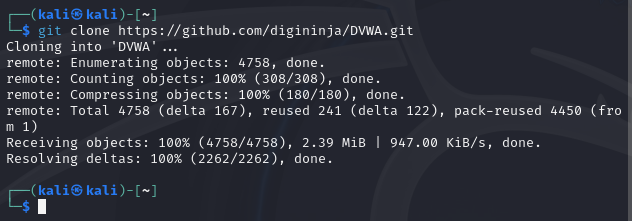{#fig:001 width=70%}

## Выполнение 2 этапа

Далее перемещаем необходимые файлы согласно примеру: 

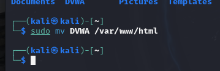{#fig:002 width=70%}

## Выполнение 2 этапа

И заходим в эту директорию: 

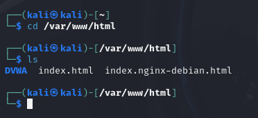{#fig:003 width=70%}

## Выполнение 2 этапа

По ссылке $https://localhost$ ничего нет

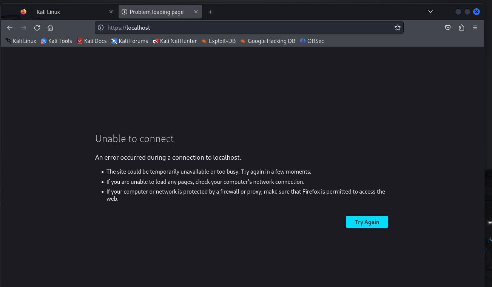{#fig:004 width=70%}

## Выполнение 2 этапа

Открываем файл $config.inc.php$ в $config$:

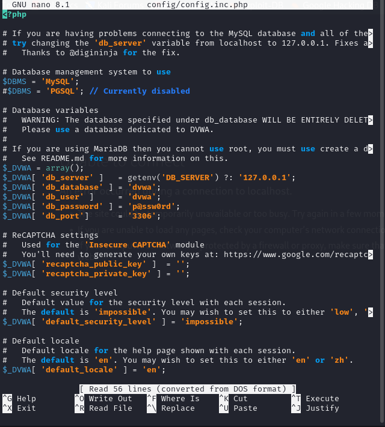{#fig:005 width=40%}

## Выполнение 2 этапа

Запускаем $apache2$ и выполняем следующие действия:

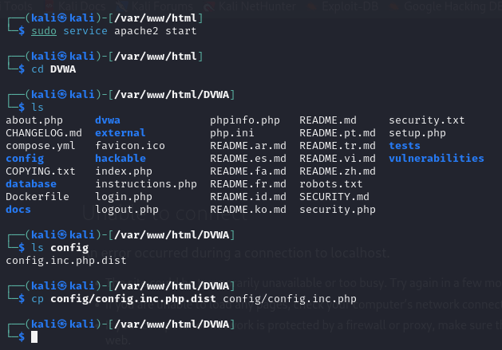{#fig:006 width=55%}

## Выполнение 2 этапа

Чтобы зайти от имени администратора я сначала устанавливаю пароль $root$, а потом уже захожу от имени администратора:

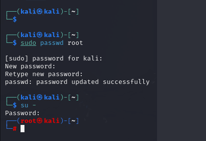{#fig:007 width=50%}

## Выполнение 2 этапа

Затем выполняю команду $mysql$ и ввожу там следующие команды: 

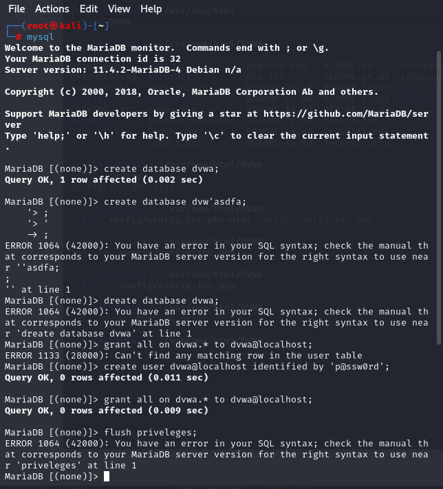{#fig:008 width=35%}

## Выполнение 2 этапа

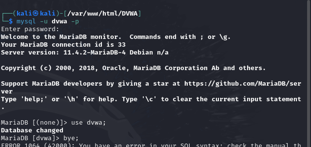{#fig:009 width=70%}

## Выполнение 2 этапа

Теперь по адресу $localhost/DVWA/login.php$ создаю базу данных с помощью кнопки на сайте "Create/Change Database". 
И захожу с именем пользователя и паролем по умолчанию:

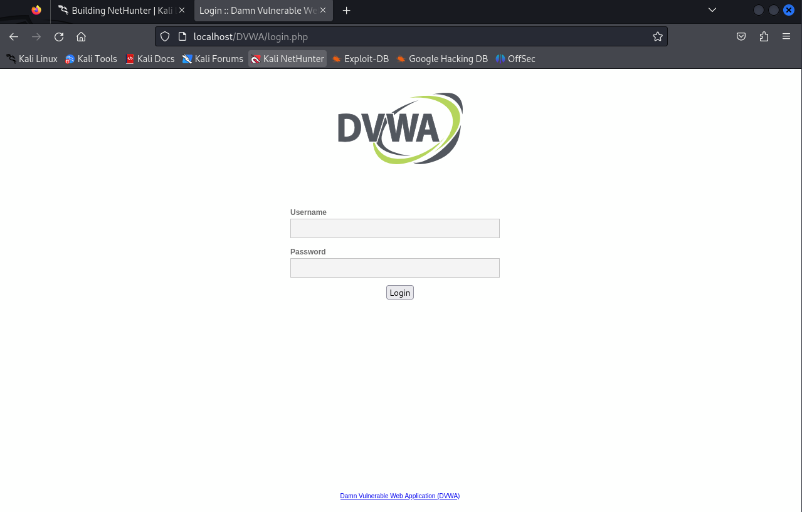{#fig:010 width=50%}

## Выполнение 2 этапа

Оказываемся на следующей странице: 

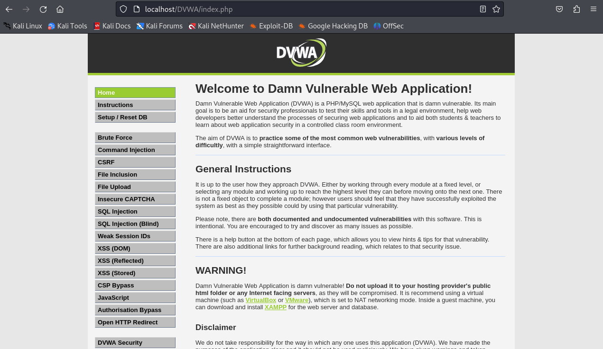{#fig:011 width=70%}

## Выполнение 2 этапа

Устанавливаем низкий уровень $DVWA Security$ для дальнейшей работы. 

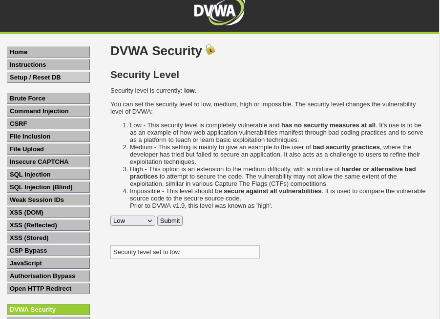{#fig:012 width=55%}

## Выполнение 2 этапа

Затем выполняем ряд команд по примеру: 

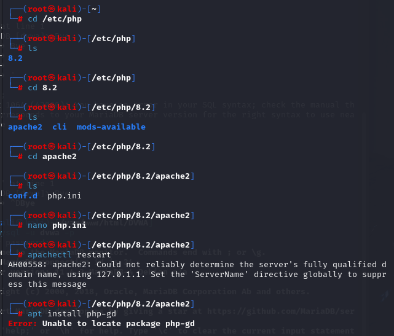{#fig:013 width=45%}

## Выполнение 2 этапа

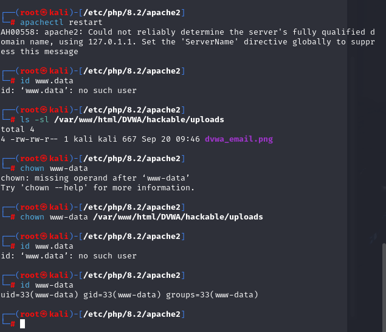{#fig:014 width=45%}

## Вывод

В результате выполнения второго этапа индиивидуального проекта я установила DVWA в гостевую 
систему Kali Linux.

