---
## Front matter
title: "Отчёт по 4 этапу индивидуального проекта"
subtitle: "Использование nikto"
author: "Аристова Арина Олеговна"

## Generic otions
lang: ru-RU
toc-title: "Содержание"

## Bibliography
bibliography: bib/cite.bib
csl: pandoc/csl/gost-r-7-0-5-2008-numeric.csl

## Pdf output format
toc: true # Table of contents
toc-depth: 2
lof: true # List of figures
fontsize: 12pt
linestretch: 1.5
papersize: a4
documentclass: scrreprt
## I18n polyglossia
polyglossia-lang:
  name: russian
  options:
	- spelling=modern
	- babelshorthands=true
polyglossia-otherlangs:
  name: english
## I18n babel
babel-lang: russian
babel-otherlangs: english
## Fonts
mainfont: PT Serif
romanfont: PT Serif
sansfont: PT Sans
monofont: PT Mono
mainfontoptions: Ligatures=TeX
romanfontoptions: Ligatures=TeX
sansfontoptions: Ligatures=TeX,Scale=MatchLowercase
monofontoptions: Scale=MatchLowercase,Scale=0.9
## Biblatex
biblatex: true
biblio-style: "gost-numeric"
biblatexoptions:
  - parentracker=true
  - backend=biber
  - hyperref=auto
  - language=auto
  - autolang=other*
  - citestyle=gost-numeric
## Pandoc-crossref LaTeX customization
figureTitle: "Рис."
tableTitle: "Таблица"
listingTitle: "Листинг"
lofTitle: "Список иллюстраций"
lotTitle: "Список таблиц"
lolTitle: "Листинги"
## Misc options
indent: true
header-includes:
  - \usepackage{indentfirst}
  - \usepackage{float} # keep figures where there are in the text
  - \floatplacement{figure}{H} # keep figures where there are in the text
---

# Задание

Установить DVWA в гостевую систему к Kali Linux.

# Выполнение лабораторной работы

Клонирую заданный репозиторий по ссылке:

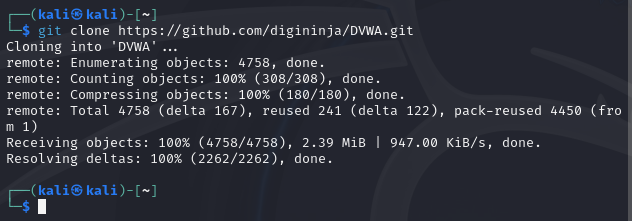{#fig:001 width=70%}

Далее перемещаем необходимые файлы согласно примеру: 

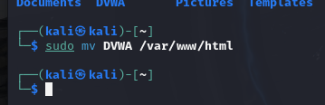{#fig:002 width=70%}

И заходим в эту директорию: 

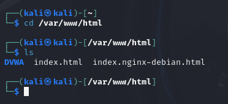{#fig:003 width=70%}

По ссылке $https://localhost$ ничего нет

{#fig:004 width=70%}

Открываем файл $config.inc.php$ в $config$:

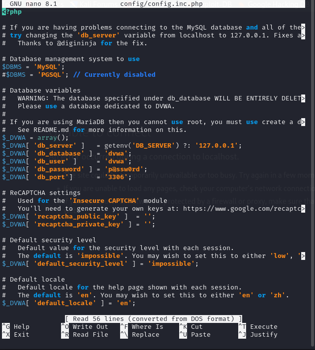{#fig:005 width=70%}

Запускаем $apache2$ и выполняем следующие действия:

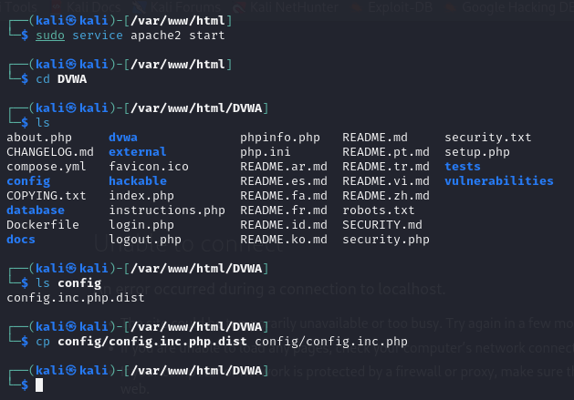{#fig:006 width=70%}

Чтобы зайти от имени администратора я сначала устанавливаю пароль $root$, а потом уже захожу от имени администратора:

{#fig:007 width=70%}

Затем выполняю команду $mysql$ и ввожу там следующие команды: 

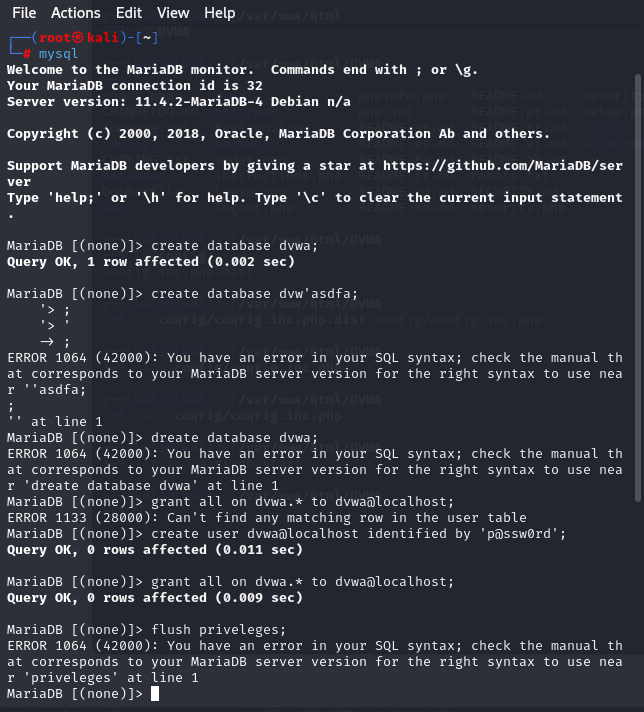{#fig:008 width=70%}

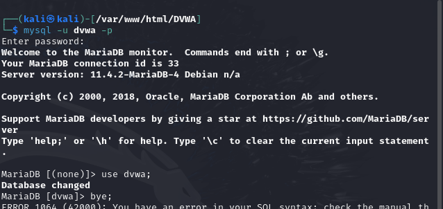{#fig:009 width=70%}

Теперь по адресу $localhost/DVWA/login.php$ создаю базу данных с помощью кнопки на сайте "Create/Change Database". 
И захожу с именем пользователя и паролем по умолчанию:

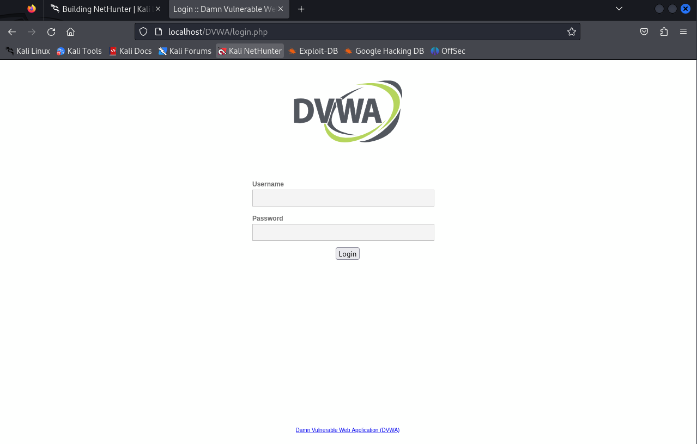{#fig:010 width=70%}

Оказываемся на следующей странице: 

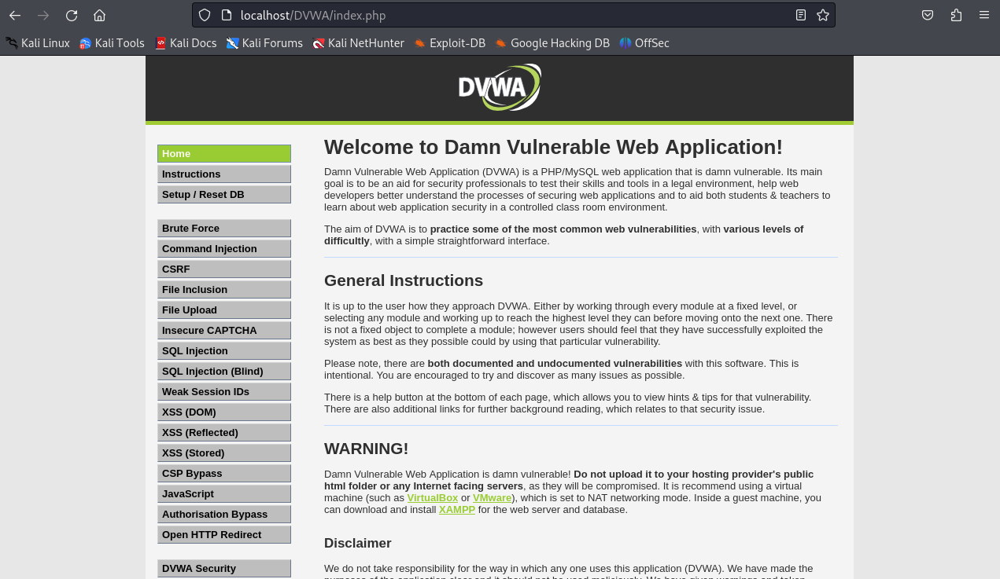{#fig:011 width=70%}

Устанавливаем низкий уровень $DVWA Security$ для дальнейшей работы. 

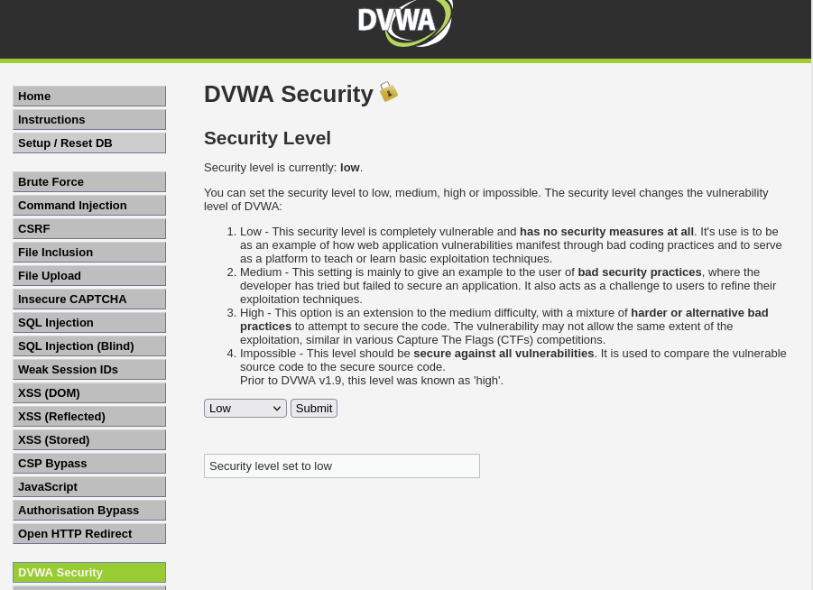{#fig:012 width=70%}

Затем выполняем ряд команд по примеру: 

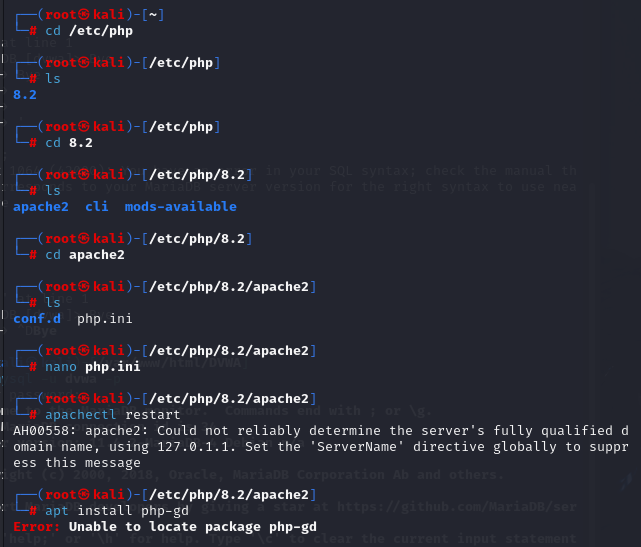{#fig:013 width=70%}

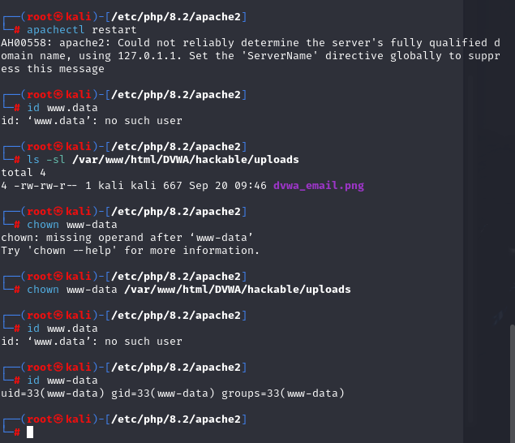{#fig:014 width=70%}

# Выводы

В результате выполнения второго этапа индиивидуального проекта я установила DVWA в гостевую 
систему Kali Linux.

